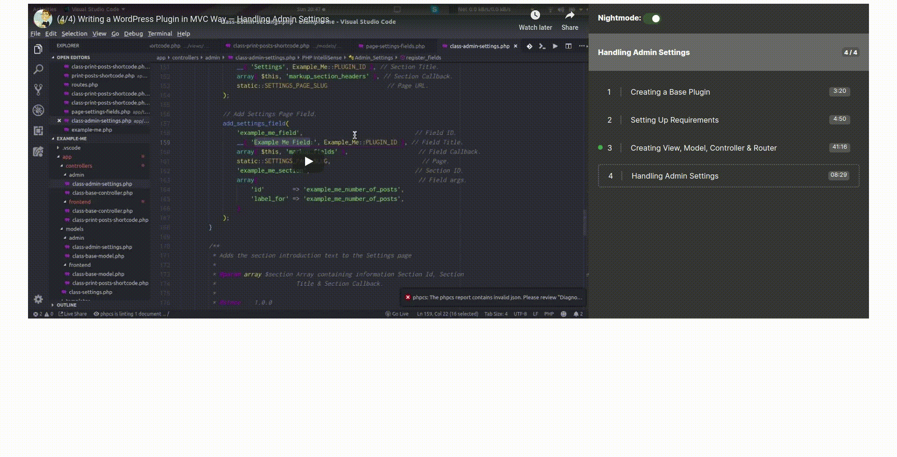

# Play Youtube Videos in Playlist Format using React

## Install
1. Execute `npm install` to install dependencies
2. Fire `npm run-script start` to run project. It will open port 3000 on localhost. So you can access the project on http://localhost:3000

## Folder Structure
```
.
├── build
├── .gitignore
├── package.json
├── public
│   ├── favicon.ico
│   ├── index.html                             
│   └── manifest.json
├── README.md
├── screenshot.gif
└── src
    ├── components
    │   ├── containers
    │   │   ├── App.js                         # Entry point to the Application
    │   │   ├── Player.js                      # Main Player Component
    │   │   ├── Playlist.js                    # Playlist Component   
    │   │   └── PlaylistItems.js               # All Playlist Items Component
    │   ├── Nightmode.js                       # Nightmode Component
    │   ├── PlaylistHeader.js
    │   ├── PlaylistItem.js                    # Single Playlist Item Component
    │   ├── styles                             # Styled Components
    │   │   ├── GlobalStyle.js
    │   │   ├── StyledJourney.js
    │   │   ├── StyledNightmode.js
    │   │   ├── StyledPlayer.js
    │   │   ├── StyledPlaylistHeader.js
    │   │   ├── StyledPlaylistItem.js
    │   │   ├── StyledPlaylistitems.js
    │   │   ├── StyledPlaylist.js
    │   │   ├── StyledVideo.js
    │   │   └── StyledVideoWrapper.js
    │   └── Video.js
    ├── index.js
    ├── serviceWorker.js
    └── Videos.js                              # List of Videos to Play

```

## Screenshot
